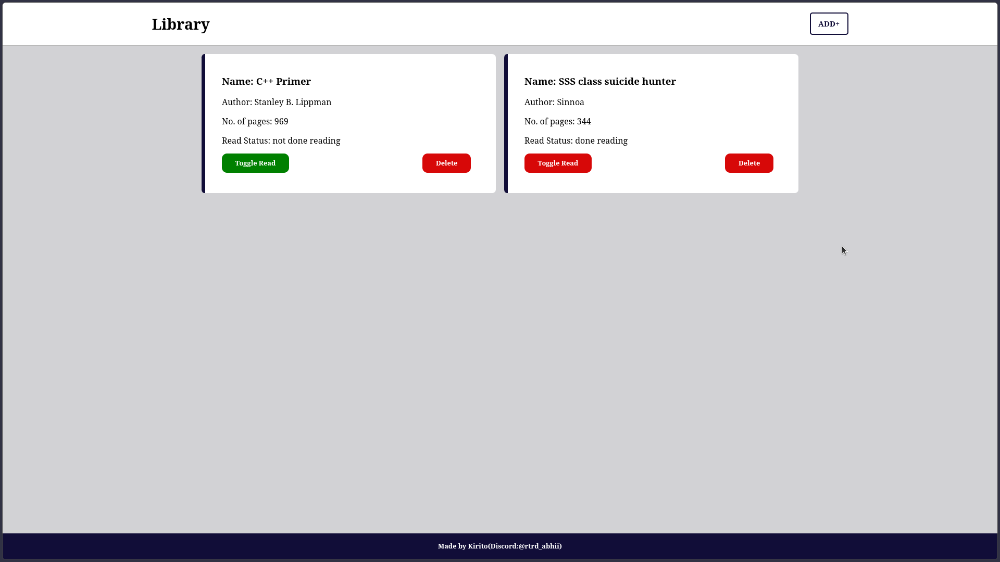

# Library
Part of the odin project, Will try to document my stuff better now.  

  
<h1>Library System</h1>
A library system as the part of odin project which saves new books, can toggle the status of the reading and delete and add new books. That's actually abt it.